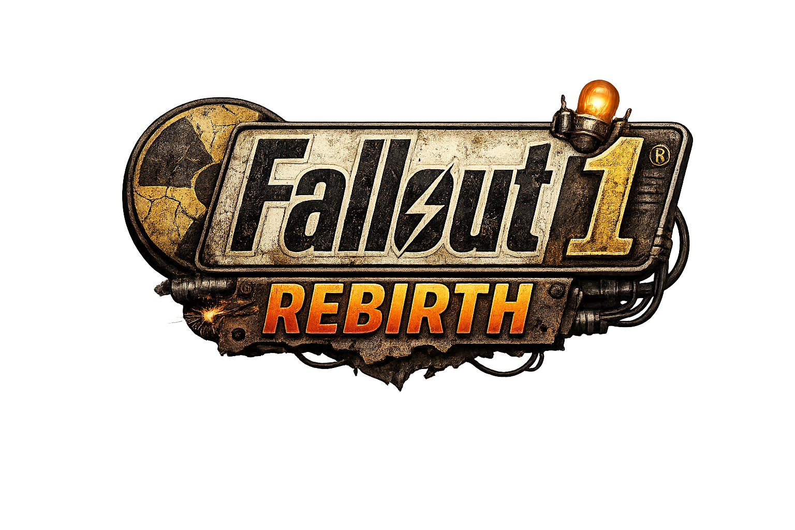

  

# Fallout 1 Rebirth

**Play Fallout 1 on your Mac or iPad** — the classic 1997 RPG, rebuilt for Apple platforms.

Fallout 1 Rebirth is a modern engine reimplementation that lets you play Fallout on macOS and iOS/iPadOS with native performance, bug fixes, and quality-of-life improvements.

> **You must own the game** — This is an engine only. Game data files from [GOG](https://www.gog.com/game/fallout) or [Steam](https://store.steampowered.com/app/38400) are required.

---

## ✨ Features

- **Native Apple Silicon** — Runs natively on M1/M2/M3/M4 Macs and modern iPads
- **Full touch support** — Intuitive gestures + Apple Pencil integration on iPad
- **Magic Keyboard/Trackpad** — Full mouse and keyboard support on iPad
- **VSync & ProMotion** — Smooth 120Hz gameplay on compatible displays
- **Retina display support** — Sharp 2X scaling for high-DPI screens
- **Engine bug fixes** — Survivalist perk fix, combat improvements, and more
- **Community improvements** — Object tooltips, combat enhancements, TeamX patch compatibility

---

## 📥 Download

**[Download the latest release →](https://github.com/nicholasmorgan/fallout1-rebirth/releases)**

| Platform | Download | Requirements |
|----------|----------|--------------|
| **macOS** | `Fallout 1 Rebirth.dmg` | macOS 11+ (Big Sur or later) |
| **iOS/iPadOS** | `fallout1-rebirth.ipa` | iOS 14+ (sideloading required) |

---

## 🚀 Quick Start

### What You Need

1. **The app** — Download from [Releases](https://github.com/nicholasmorgan/fallout1-rebirth/releases)
2. **Game data** — From your GOG or Steam copy of Fallout 1:
   - `master.dat` (~300 MB)
   - `critter.dat` (~25 MB)
   - `data/` folder
3. **Config files** — Included in releases or from [gameconfig/](gameconfig/)

### macOS Installation

1. Download and install `Fallout 1 Rebirth.dmg`
2. Right-click the app → **Show Package Contents** → open `Contents/MacOS/`
3. Copy your game files (`master.dat`, `critter.dat`, `data/`) into this folder
4. Copy config files (`fallout.cfg`, `f1_res.ini`) from [gameconfig/macos/](gameconfig/macos/)
5. Run the app!

> 📖 **Need help?** See the [complete setup guide](docs/setup_guide.md) for detailed instructions.

### iPad Installation

1. Download `fallout1-rebirth.ipa`
2. Sideload using [AltStore](https://altstore.io/) or [Sideloadly](https://sideloadly.io/)
3. Run the app once (it will show a "missing datafile" error — that's normal)
4. Use Finder to copy game files + config files into the app's Documents folder
5. Relaunch and play!

> 📖 **iPad setup** is more involved. See [docs/setup_guide.md](docs/setup_guide.md) for step-by-step instructions.

---

## 🎮 Controls

### iPad Touch Controls

| Gesture | Action |
|---------|--------|
| Tap | Move cursor + click |
| Drag | Move cursor |
| Two-finger tap | Right-click (change cursor mode) |
| Three-finger tap | Click without moving cursor |

### Apple Pencil

| Gesture | Action |
|---------|--------|
| Tap near cursor | Left-click |
| Tap away from cursor | Move cursor only |
| Long-press | Right-click |
| Double-tap pencil body | Right-click (2nd gen+) |

### Magic Keyboard / Trackpad

Full mouse and keyboard support — works just like on Mac.

---

## 📚 Documentation

| Guide | Description |
|-------|-------------|
| [Setup Guide](docs/setup_guide.md) | Complete installation walkthrough |
| [Configuration](docs/configuration.md) | All settings explained |
| [Features](docs/features.md) | Full list of improvements and fixes |

---

## ❓ Troubleshooting

**"Could not find the master datafile"**  
→ Game data files aren't in the right location. See [setup guide](docs/setup_guide.md).

**Game runs at wrong resolution**  
→ Make sure `f1_res.ini` is in the same folder as your game data.

**Files have wrong case (MASTER.DAT vs master.dat)**  
→ Filenames must be lowercase. See [setup guide](docs/setup_guide.md#part-2-getting-game-data-files).

---

## 🔧 For Developers

Want to build from source or contribute? See:

- [Building from source](docs/building.md)
- [Contributing guidelines](docs/contributing.md)
- [Architecture overview](docs/architecture.md)

---

## 🙏 Credits

- **Original game**: Interplay / Black Isle Studios
- **Engine reimplementation**: [alexbatalov/fallout1-ce](https://github.com/alexbatalov/fallout1-ce)
- **Community contributors**: evaera, zverinapavel, radozd, korri123, and many others

> For Windows, Linux, or Android, use the upstream project: [fallout1-ce](https://github.com/alexbatalov/fallout1-ce)

---

## 📄 License

Source code is available under the [Sustainable Use License](LICENSE.md).
