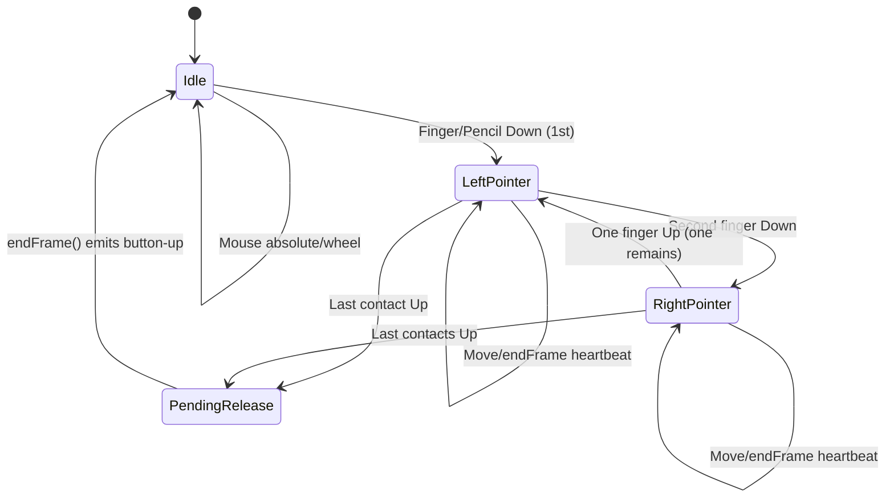

# SDL3 Input Architecture - 2026-02-15

## Scope
Deterministic SDL3 input translation for Fallout 1 Rebirth across:
- macOS mouse/trackpad
- iPadOS touch (single/two-finger)
- Apple Pencil (tip + body gesture right click)

Primary implementation files:
- `src/plib/gnw/input_state_machine.h`
- `src/plib/gnw/input_state_machine.cc`
- `src/plib/gnw/input_mapping.h`
- `src/plib/gnw/input_mapping.cc`
- `src/plib/gnw/touch.cc`
- `src/plib/gnw/mouse.cc`
- `src/plib/gnw/svga.cc`

## Deterministic Contract
- One FIFO action queue for all pointer/wheel translation (`InputStateMachine`).
- Absolute hardware mouse stream is accepted only when touch/pencil stream is inactive.
- Touch release is deferred one frame to preserve stable legacy click semantics.
- iOS mapping uses one canonical letterbox/safe-area conversion contract.

## Event Ownership
- SDL finger events: `GNW95_process_message` -> `touch_handle_*` -> `InputStateMachine::onFinger*`.
- SDL mouse/trackpad events: `dxinput_get_mouse_state` -> `touch_submit_mouse_state` -> `InputStateMachine::onMouseAbsolute`.
- Pencil body gestures: `pencil_poll_gesture` -> `touch_enqueue_secondary_click` -> `InputStateMachine::onSecondaryClick`.
- Legacy mouse bridge: `mouse_info` drains `touch_pop_mouse_event` and applies `mouse_simulate_input`.

## State Machine
States are represented by active contact count plus pending-release flags.

| Logical state | Condition | Output buttons |
|---|---|---|
| `Idle` | no contacts, no pending release | from hardware mouse |
| `LeftPointer` | one active contact (finger or pencil) | `MOUSE_STATE_LEFT_BUTTON_DOWN` |
| `RightPointer` | two or more active contacts | `MOUSE_STATE_RIGHT_BUTTON_DOWN` |
| `PendingRelease` | no contacts, deferred release armed | one deterministic pointer-up emission |

## Event Diagram

## Coordinate Mapping Contract
`input_compute_letterbox_rect(containerX, containerY, containerW, containerH, gameW, gameH)`:
- computes active content rect in pixel space
- supports portrait/landscape, windowed/fullscreen, and safe-area insets

`input_map_screen_to_game(rect, gameW, gameH, screenX, screenY, &gameX, &gameY)`:
- maps any screen point into clamped game coordinates
- returns in-bounds boolean for content-vs-bars decision

iOS usage:
- `iOS_updateDestRect` computes safe-area-aware destination rect.
- `iOS_screenToGameCoords` calls shared mapper.
- `iOS_windowToGameCoords` normalizes window points to render pixels, then maps.

## Gesture Semantics
- Single-finger drag/tap: left button stream.
- Two-finger drag/tap: right button stream (centroid of first two active contacts).
- Pencil tip: left button precise pointer stream.
- Pencil body (double-tap/squeeze): synthetic right-click sequence at current cursor.

## Failure Modes Closed
- Cursor jump/teleport: out-of-bounds moves do not mutate contact position; mapping/handoff is gated.
- Stale-position click: deferred release + mouse handoff blocking until release emission.
- Drag instability: deterministic heartbeat while active drag is held.
- Pencil down/up mismatch: pencil uses same deterministic pointer stream and deferred release policy.
- OS pointer/game cursor desync: hardware absolute updates are translated through one queue and applied as absolute cursor targets.

## Automated Validation
- `scripts/test/test-input-layer.sh`
  - unit scenarios for gesture semantics, handoff gating, stale-click prevention, and coordinate mapping.
- `scripts/test/test-macos-headless.sh`
  - app/bundle validation + brief launch.
- `scripts/test/test-ios-headless.sh`
  - simulator install/launch + automated screenshot evidence capture.
- `dev/run-unattended-until-100.sh --track both`
  - continuous config + input validation until 100% pass.
