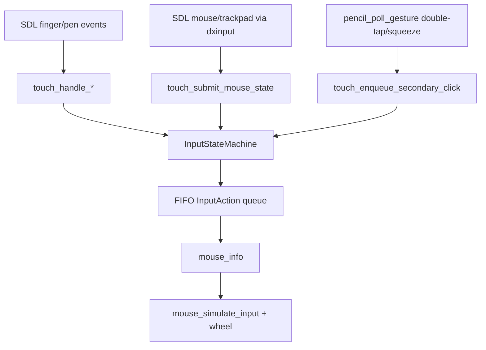

# SDL3 Deterministic Input Audit - 2026-02-15

## Goal
Deliver a single deterministic SDL3 input translation layer for macOS + iOS/iPadOS that preserves desktop mouse behavior and stabilizes touch/pencil semantics.

## Git History Review (Input Path)
Reviewed files:
- `src/plib/gnw/input.cc`
- `src/plib/gnw/mouse.cc`
- `src/plib/gnw/touch.cc`
- `src/plib/gnw/dxinput.cc`
- `src/plib/gnw/svga.cc`
- `src/plib/gnw/winmain.cc`
- `src/platform/ios/pencil.mm`

### Timeline of Tried/Reverted Changes
| Commit | Date (local) | Attempt | Outcome | Reverted/Why |
|---|---|---|---|---|
| `74b8bbe` | 2026-02-03 | Deferred tap release in `mouse_info` (button-up next frame). | Improved click registration but introduced fragile stateful path in gesture branch. | Partially rolled back by `11de3ee` while broader mouse behavior was reset. |
| `11de3ee` | 2026-02-04 | Roll back prior mouse-state changes; remove deferred release path. | Restored older behavior but reintroduced immediate-release edge cases. | Superseded by later deterministic queue/state-machine approach. |
| `fb51a66` | 2026-02-04 | Convert touch coords via SDL logical transform (`SDL_RenderWindowToLogical`). | Did not solve touch offset on iPad; mapping still inconsistent. | Explicitly reverted by `f8397c3`. |
| `f8397c3` | 2026-02-04 | Revert SDL logical transform experiment; return to direct normalized scaling. | Reduced one class of offset but left system fragmented. | Superseded by shared mapping contract in final solution. |
| `0c8f6c3` | 2026-02-04 | Restore known-good touch path from `3f9e296`; recover pencil config behavior. | Stabilized a regressed baseline. | Temporary; later changes diverged again. |
| `12137b7` | 2026-02-05 | Capture click position at button-down in `dxinput`. | Addressed stale-click symptom for one pipeline. | Removed in `faa7bd8` to test whether capture logic itself caused misalignment. |
| `faa7bd8` | 2026-02-05 | Remove click-capture; use live mapping only. | Simplified path, but stale-position and desync risk remained under mixed sources. | Superseded by deterministic FIFO action ownership. |
| `52cb14a` | 2026-02-06 | Filter synthetic touch-mouse, reset iOS button state on touch, tighten hit-test. | Reduced duplicate events/stuck buttons. | Kept as part of final ownership model. |
| `c945840` | 2026-02-06 | Tune long-press/tap thresholds and drag semantics. | Improved some gestures but still heuristic-heavy and state-fragmented. | Superseded by explicit state machine semantics. |
| `7a47066` | 2026-02-06 | Add deferred tap release + threshold tuning + touch-active mouse skip. | Better tap reliability but still coupled to recognizer timing heuristics. | Superseded by queue-driven deterministic output. |
| `dddbf51` | 2026-02-06 | Re-enable mouse fallback when no gesture active. | Restored desktop path in idle touch state. | Preserved conceptually in final ownership gating (`touch_is_pointer_active`). |
| `74c5987` | 2026-02-07 | iOS edge/keyboard transition smoothing, relative-mode/resize handling, touch bounds retention. | Addressed stutter/edge behavior; introduced additional complexity. | Later refactors replaced pieces with shared mapping and simpler changed-rect logic. |
| `667203b` | 2026-02-14 | Rework macOS/iOS mouse mapping and window behavior. | Large mixed change set; unresolved iPad input regressions remained. | Superseded by focused deterministic input layer split. |
| `571d15d` | 2026-02-14 | iPad resolution/input follow-up adjustments. | Added pen synthetic filtering and out-of-bounds suppression. | Kept as baseline hardening; deterministic layer now unifies upstream behavior. |
| current (working tree) | 2026-02-15 | Introduce `InputStateMachine` + `input_mapping`; rebuild touch/mouse bridge around FIFO events. | Deterministic ownership, unified mapping, automated validation coverage. | Target implementation. |

## Final Architecture (Implemented)
- Deterministic translation core:
  - `src/plib/gnw/input_state_machine.h`
  - `src/plib/gnw/input_state_machine.cc`
- Shared coordinate mapping:
  - `src/plib/gnw/input_mapping.h`
  - `src/plib/gnw/input_mapping.cc`
- Touch wrapper now forwards all gesture/mouse synthesis through state machine:
  - `src/plib/gnw/touch.cc`
- Legacy integration point drains translated queue only:
  - `src/plib/gnw/mouse.cc`
- Pencil body gestures routed through same queue:
  - `src/plib/gnw/input.cc`
- iOS mapping/safe-area/windowing path uses shared letterbox mapper:
  - `src/plib/gnw/svga.cc`
- Synthetic pen->mouse/pen->touch events disabled at startup:
  - `src/plib/gnw/winmain.cc`

## Event/State Diagram

## Failure Modes Fixed
| Failure mode | Fix | Validation |
|---|---|---|
| Cursor jump / transient teleport | Ignore out-of-bounds move updates for active touch stream; canonical mapping + pointer ownership gating. | `test_out_of_bounds_move_does_not_jump`, `test_mouse_path_is_blocked_while_touch_active` in `src/plib/gnw/input_layer_test.cc`. |
| Stale-position click | Deferred final release and blocked mouse handoff until deterministic release emission. | `test_stale_position_click_prevention` in `src/plib/gnw/input_layer_test.cc`. |
| Drag instability | Deterministic heartbeat during active drag and FIFO ordering. | `test_single_finger_drag_stability_heartbeat` and `test_two_finger_right_drag`. |
| Pencil down/up mismatch | Pencil tip uses same left-button state machine down/move/up sequence. | `test_pencil_precise_down_move_up`. |
| OS pointer vs game cursor desync | Hardware absolute pointer translated through unified queue only when touch stream inactive. | `test_mouse_absolute_sync_no_touch`; headless mouse path checks. |
| iPad orientation/window/safe-area mapping drift | Shared `input_compute_letterbox_rect` + `input_map_screen_to_game` used by iOS coordinate conversion. | `test_mapping_portrait_fullscreen`, `test_mapping_landscape_fullscreen`, `test_mapping_safe_area_insets`, `test_mapping_windowed_and_dynamic_bounds`. |
| Gesture semantics mismatch | Explicit single-finger left and two-finger right mapping; secondary click queue for Pencil body gesture. | `test_single_finger_click_and_drag`, `test_two_finger_right_click`, `test_secondary_click_sequence`. |

## Automated Validation Assets
- Unit layer tests:
  - `scripts/test/test-input-layer.sh`
- Headless platform checks:
  - `scripts/test/test-macos-headless.sh`
  - `scripts/test/test-ios-headless.sh` (now captures simulator screenshot evidence)
- Unattended gate:
  - `dev/run-unattended-until-100.sh`

Evidence locations (latest run):
- `dev/state/latest-summary.tsv`
- `dev/state/history.tsv`
- Latest history row: `1	input	1	1	100	PASS	2026-02-15T17:25:24Z`
- `dev/state/logs/round-1-input-input_layer.log`
- `dev/state/logs/round-1-input-macos_headless.log`
- `dev/state/logs/round-1-input-ios_headless.log`
- `dev/state/logs/screens/round-1-ios_headless/ios-headless-com-fallout1rebirth-game-20260215T172516Z.png`

## Build Artifacts (Fresh)
- macOS app: `releases/prod/macOS/Fallout 1 Rebirth.app`
- iOS IPA: `releases/prod/iOS/fallout1-rebirth.ipa`

Fingerprint evidence:
- `releases/prod/macOS/Fallout 1 Rebirth.app/Contents/MacOS/fallout1-rebirth`
  - mtime: `2026-02-15 11:26:32`
  - sha256: `6294c3431ec9f1d3448ebd840353a266717f02056bc82fbce72a963eb3ce8192`
- `releases/prod/iOS/fallout1-rebirth.ipa`
  - mtime: `2026-02-15 10:59:59`
  - sha256: `68c27a63ee58ad6c4385614dcc02bfd68d47505e23c8562ddab62d185e8b2f7f`
